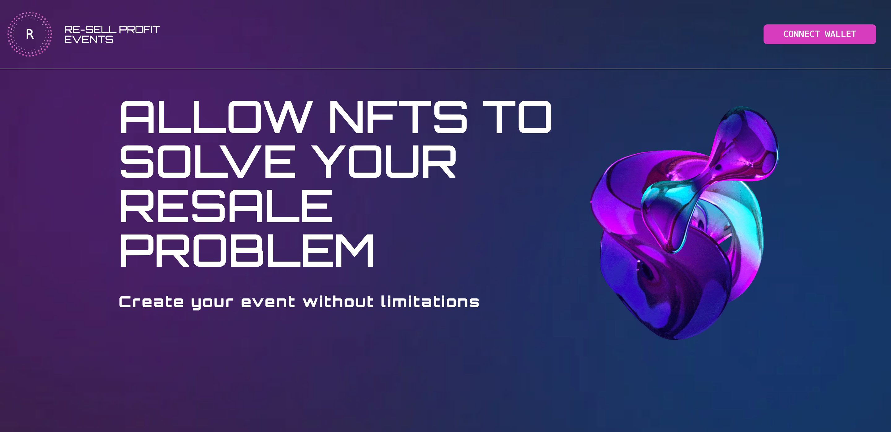
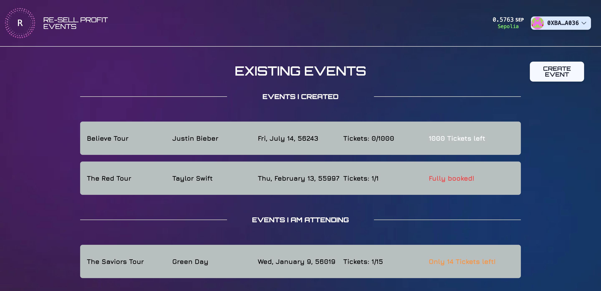
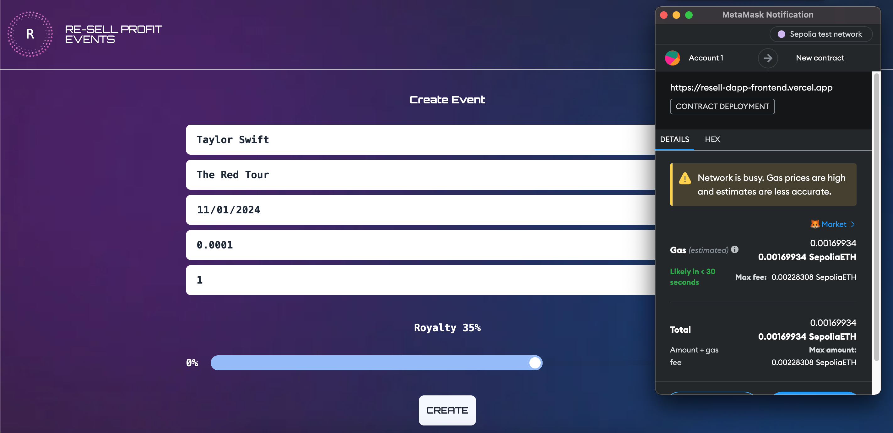
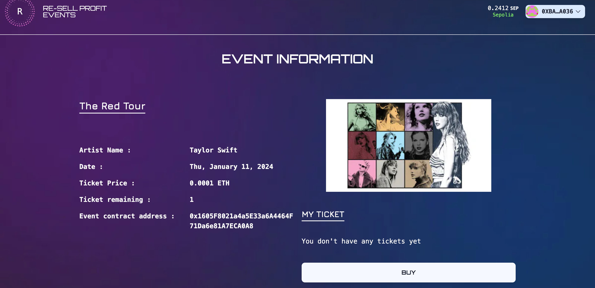
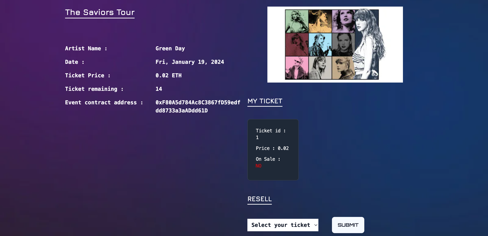
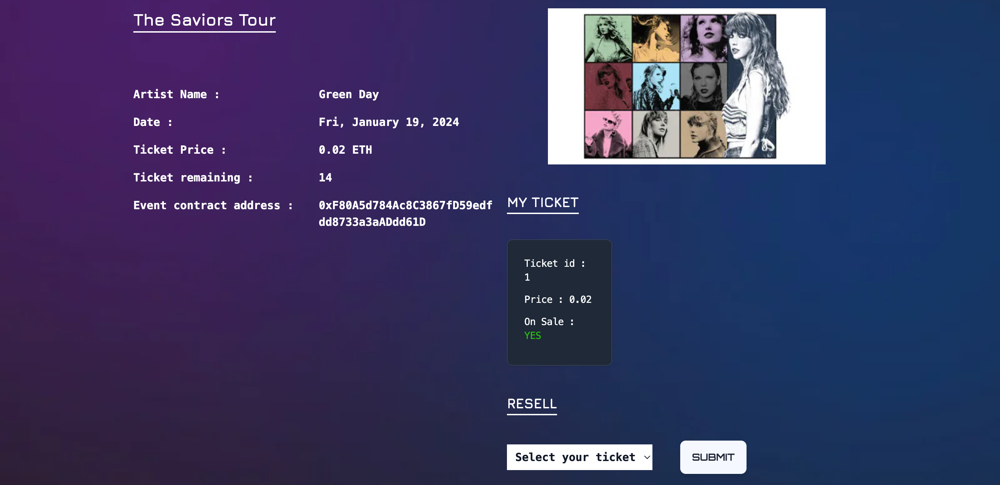

# Marketplace resale dApp

Final project Encode Solidity Bootcamp Q4

This project is a collaborative effort as part of the Encode Solidity Bootcamp Q4. Our group had approximately one week to develop this full-stack dApp.

We constructed a Solidity NFT contract based on the ERC-721 NON-FUNGIBLE TOKEN STANDARD. The frontend was implemented using Typescript, Scaffold-ETH dApp template, and Next.js. The REST API was developed with a Nest.js backend and a MongoDB database, hosted on Atlas. You can find both frontend and backend code in their respective folders within this GitHub repository.

The project addresses the issue of event owners/creators not benefiting from resales on the secondary/resell market of their event tickets.

An event creator can create an event, deploying an Event.sol contract on-chain. The owner can specify the number of available tickets for the event, the price of each ticket, and the royalty percentage they want to receive for each ticket sold on the secondary market.

A user can purchase a ticket, resulting in the minting of a ticket NFT in the Event contract if the number of tickets already minted is less than the total available tickets specified by the event owner. However, if the tickets are already sold out (ticketsMinted === totalTickets), the buyer will acquire the first ticket NFT from the resell queue (an on-chain array, following the FIFO queue principle). This, of course, is only possible if a seller is available in the resell queue.

A user can also resell their ticket. If all tickets have been sold and the seller has reached the first index of the FIFO resell queue, their ticket will be sold. From the ticket price, the on-chain specified royalty fee percentage will be returned to the event creator.

With event tickets represented as NFTs, the buying and reselling process becomes more transparent, ensuring that the event owner receives a royalty for every resold ticket.

### Events available

After connecting to a wallet, you will be greeted by all available events. You can see events you created, events you are attending (events where you bought a ticket NFT), and all other events.

### Create your event on-chain!

Create your event, specify a price, available tickets and your royalty fee in case of a resell. Deploy the Event contract on-chain!

### Buy a ticket NFT

### Resell your ticket

Resell your ticket

After you clicked, the ticket will be put in the market for resale. Once it reached the first index of the FIFO resell queue, the next buyer will buy the ticket from you! The event creator will get his share. Fair, isn't it?
